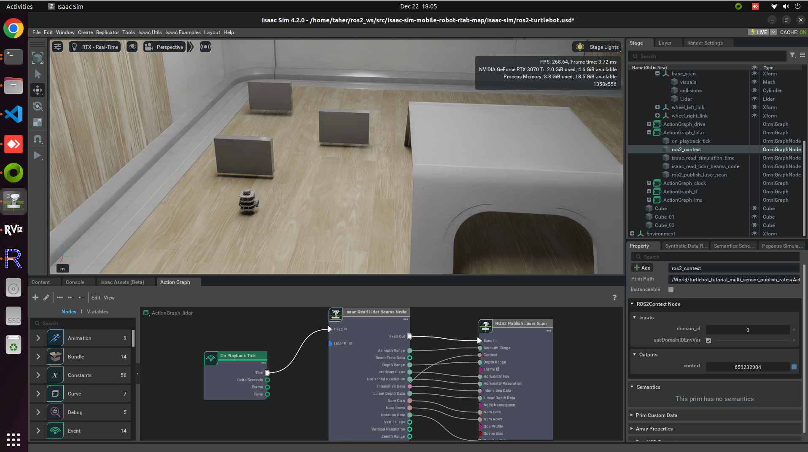

# Mapping, Navigation, and Simulation with Nvidia Isaac Sim, RTAB-Map, Navigation2 and RViz2 

Integrate RTAB-Map for SLAM, the Navigation2 stack for autonomous navigation, RViz2 for real-time visualization, and NVIDIA Isaac Sim for high-fidelity simulations.

## Demo Video
[](https://youtu.be/NRXYgfIl9uc)


## Key Components

1. **Isaac Sim**
- NVIDIA's Isaac Sim provides high-fidelity simulation environments to test and refine robotic applications in realistic virtual scenarios.
- Supports physics-based simulation, synthetic data generation, and ROS2 integration for end-to-end testing of navigation and perception systems.
  
2. **RTAB-Map**
- Real-Time Appearance-Based Mapping (RTAB-Map) is used for simultaneous localization and mapping (SLAM). It supports 2D and 3D mapping using RGB-D sensors, LiDAR, or stereo cameras.
- Features include loop closure detection, memory management, and real-time map updates, making it ideal for dynamic environments.

3. **Navigation2**
- The Navigation2 (Nav2) stack enables autonomous navigation for mobile robots in complex environments.
- Includes robust path planning, obstacle avoidance, recovery behaviors, and real-time localization using techniques like AMCL and SLAM integration.

4. **RViz2**
- RViz2 is a powerful visualization tool in the ROS2 ecosystem, offering real-time rendering of robot states, -sensor data, maps, and navigation goals.
Facilitates debugging and system diagnostics with an intuitive GUI.


## Dependencies and Setup

-  Install ROS 2 Humble - [Read here](https://docs.ros.org/en/humble/Installation.html)
-  Create Workspace - [Read here](https://docs.ros.org/en/humble/Tutorials/Beginner-Client-Libraries/Creating-A-Workspace/Creating-A-Workspace.html)
- RTAB-Map [Read here](https://github.com/introlab/rtabmap_ros/tree/ros2#rtabmap_ros)
```sh
sudo apt install ros-<distro-name>-rtabmap-ros
```
- Nav2 [READ here](https://github.com/ros-navigation/navigation2)
```sh
sudo apt install ros-<distro-name>-navigation2 sudo apt install ros-<distro-name>-nav2-bringup
```

## Building the Package
After cloning this repository into your workspace’s ```src``` directory:
```sh
cd <your_ros2_ws>
colcon build
source install/setup.bash
```

## Usage

1. **Isaac Simulation**
Open the <b>ros2-turtlebot.usd</b> file located in the isaac-sim folder.
Or run this command:
```py
ISAACSIM_PYTHON script/run-sim.py
```

2. **Rviz2 for Visualization:** 
```sh
ros2 launch isaac-sim-mobile-robot-rtab-map rviz.launch.py
```

3. **RTAB-Map**
```sh
ros2 launch isaac-sim-mobile-robot-rtab-map rtab-map-scan.launch.py
```

4. **Navigation2:** 
```sh
ros2 launch isaac-sim-mobile-robot-rtab-map navigation2.launch.py
```

## Launch commands individually

1. **Run the Teleop Twist Keyboard:**
```sh
ros2 run teleop_twist_keyboard teleop_twist_keyboard
```
2. **RTAB-Map:**
```sh
ros2 launch rtabmap_demos turtlebot3_scan.launch.py
```
3. **Initializing the Navigation Stack:**
```sh
ros2 launch nav2_bringup navigation_launch.py use_sim_time:=True
```
4. **Opening RViz with Navigation Visualization:**
```sh
ros2 launch nav2_bringup rviz_launch.py
```

## Contributing
Contributions are welcome. If you find a bug or have a feature request, please open an issue or submit a pull request.

## Resources

- [Nvidia Isaac Sim](https://developer.nvidia.com/isaac/sim) robotics developer simulation platform and reference application is designed to help developers design, simulate, test, and train AI-based robots and autonomous machines in a physically based virtual environment.
- Robot Operating System [(ROS 2 Humble)](https://docs.ros.org/en/humble/index.html)
- ROS 2 [tf2](https://docs.ros.org/en/humble/Tutorials/Intermediate/Tf2/Introduction-To-Tf2.html)
- [ROS 2 Navigation](https://github.com/ros-navigation/navigation2/) Framework and System
- [RTAB-Map](https://introlab.github.io/rtabmap/) (Real-Time Appearance-Based Mapping) is a RGB-D, Stereo and Lidar Graph-Based SLAM approach based on an incremental appearance-based loop closure detector
